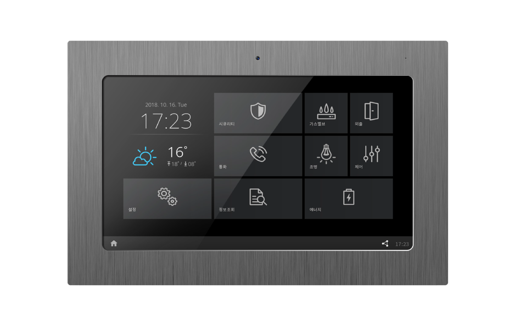

# Wallped 프로젝트
## 프로젝트 개요
### 프로젝트 주제: 실시간 환경 감지 및 IoT 기반 월패드 감시 시스템

이 프로젝트는 온습도 센서와 조도 센서를 활용하여 주변 환경의 변화를 실시간으로 모니터링하고, 월패드에서 직관적으로 확인할 수 있는 시스템을 구축하는 것을 목표로 합니다. 또한, 월패드의 기본적인 기능 (현관문 보기, 실시간 채팅)을 추가하여 IoT 기능을 구현하였습니다.

- 실시간 조도, 온도, 습도 확인 가능
- 현관문 보기 기능으로 캠 확인 가능
- 타 월패드 (타 ID)와 채팅 가능
- 시간 동기화를 통하여 현재 시간 출력

## 구성도

### STM32F411RE
- DHT11: 온도, 습도 감지
- CDS: 조도 감지
- LED: 월패드 전송 값에 따라 ON/OFF
- ESP8266: 센서 감지 결과 UART 송수신

### Raspberry Pi 4
- 디스플레이: 화면 출력
- 웹캠: 현관문 보기 웹캠
- Qt: C++로 구성된 월패드 UI

## 주요 기능
### 1. DHT11과 CDS의 센서 값 실시간 전송
- 조도, 온도, 습도 센서를 10초 간격으로 감지 및 buf에 저장
- 저장된 buf의 문자열을 ESP8266을 통해 월패드로 전송

**감지 결과를 buf 저장, 송신**

### 2. 감지 결과를 실시간 UI 표시
- 감지된 결과는 IoT 소켓 통신으로 수신
- 수신된 센서 값들을 그래프로 표시
- 센서 값은 메시지 탭에서 확인 가능

**센서 값들이 그래프를 그리고, 메시지 탭에서 상세 값을 확인할 수 있다.**

### 3. 다양한 월패드 기능
- 시간 동기화를 통하여 실시간 시간 확인 가능
- 키패드를 통하여 메시지 수신 가능
- 설치된 웹캠을 통하여 현관문 보기 가능
- 제어 화면에서 STM32F11RE에 부착된 LED 제어 가능

**시간 동기화를 통하여 실시간 시간을 표시**

**영상보기를 통하여 실시간 웹캠 감시 가능**

**LED 버튼을 통하여 STM32에 있는 LED 원격제어 가능**
## 소스 코드

### [STM32F411RE](/STM32/)
### [Wallped](/Wallped/)

## 시연 영상

### [조도,온도,습도 감지 및 UI 표시](https://drive.google.com/file/d/1gCWeGIDDWATdt3Xk5l3WrlzrLc3Rgkkl/view?usp=sharing)

### [실시간 시간 표시](https://drive.google.com/file/d/1TVUW97ZFnsKz3jvqQJSvyZzSWWjPDnSb/view?usp=sharing)

### [키패드를 통하여 메시지 수신](https://drive.google.com/file/d/1oHRbAzyli-6_JeqzuV2cmKul2beWf8BZ/view?usp=sharing)

### [현관문 보기](https://drive.google.com/file/d/1G9z46wqBTT7ZMf9RAAS05ESFlK-0gYcn/view?usp=sharing)

### [LED 제어](https://drive.google.com/file/d/1G_lkWniTCsucssTRn1Pm5442s7pYCX4v/view?usp=sharing)

