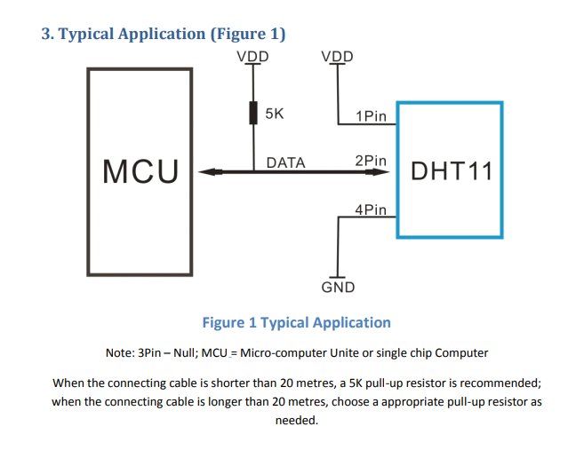
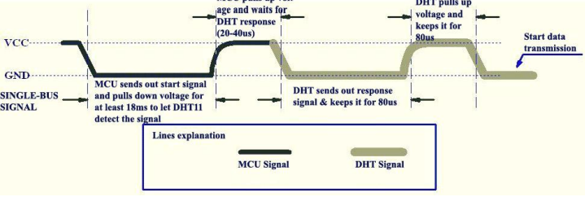
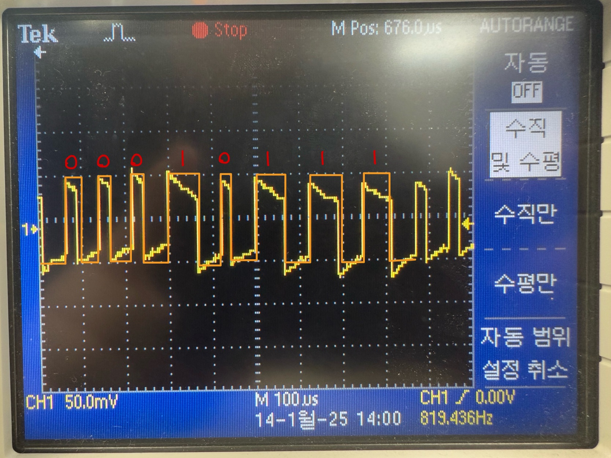
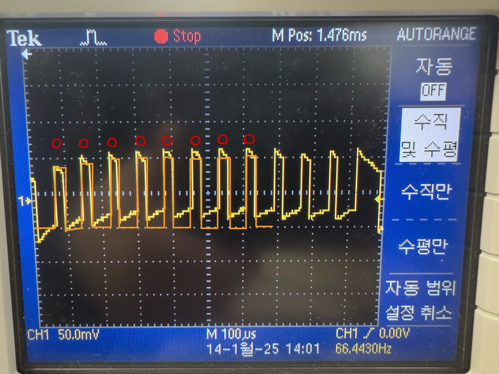
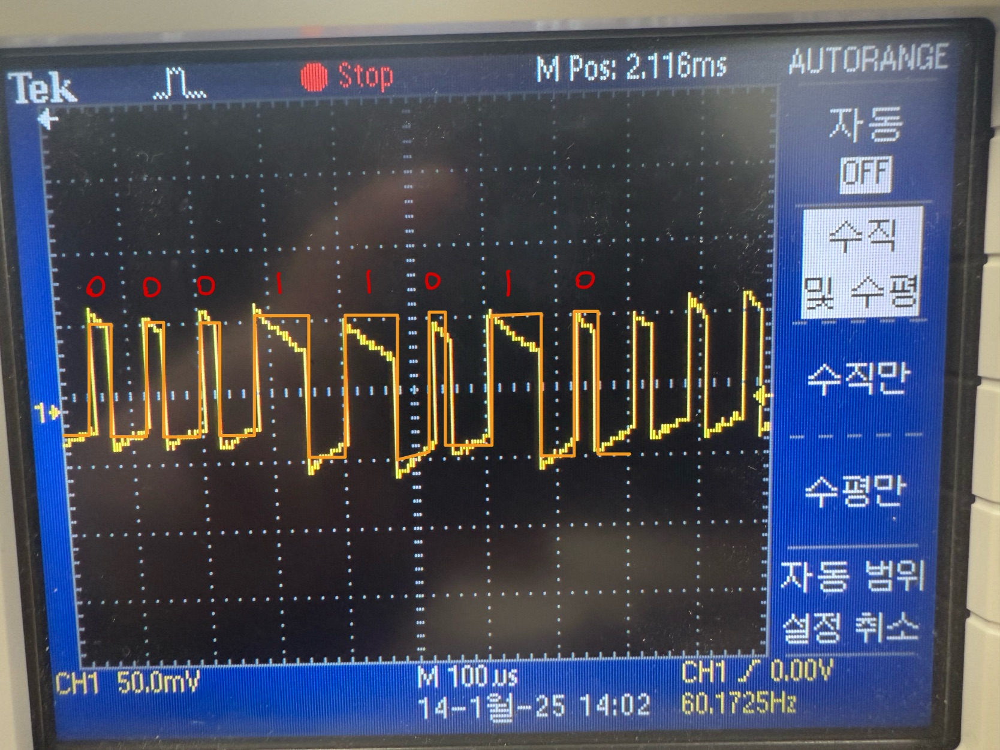
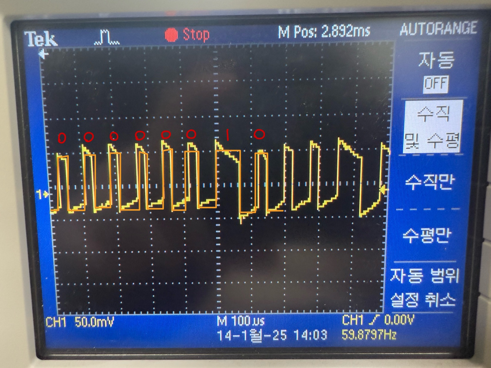
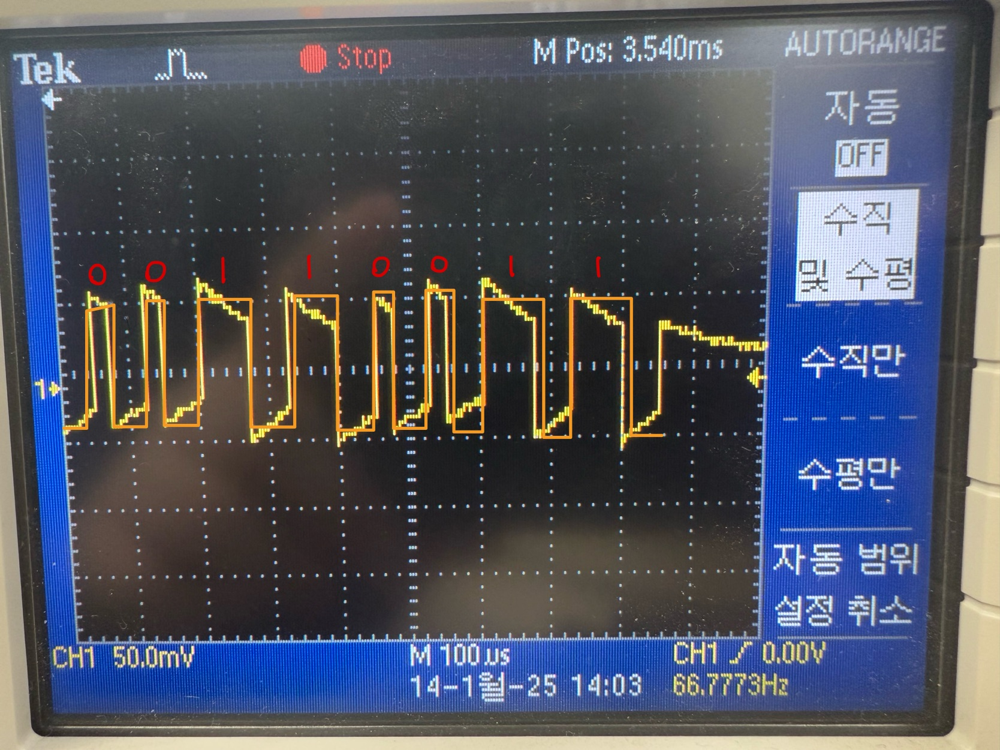

## DHT11 라이브러리

## 핀 연결법


### 특징
- DHT11은 5KΩ 풀업 저항을 쓰지만, **내장 모듈**이 있어 따로 저항 연결할 필요 없다.

### 연결 방법
1. **핀 배치**:
   - **VDD**: 전원 (+5V) -> 3 ~ 5.5V
   - **GND**: 접지 (Ground)
   - **DATA**: 데이터 통신 (디지털 신호)

2. **연결 순서**:
   - DHT11의 핀을 **VDD, GND, DATA** 순서로 연결하면 된다.
   - **DATA 핀**은 디지털 신호(`0`과 `1`)를 출력하므로, **STM32의 GPIO 핀을 OUTPUT 모드**로 설정한다.

## 통신 과정
### 시리얼 인터페이스(단일 와이어 양방향)

**5. 통신 과정: 직렬 인터페이스 (단일 와이어 양방향)**

DHT11 센서와 MCU 간의 통신 및 동기화를 위해 단일 버스 데이터 포맷(single-bus data format)을 사용함.  
하나의 통신 과정은 약 **4ms** 정도 걸림.

데이터는 소수 부분과 정수 부분으로 구성됨.  
전체 데이터 전송은 **40비트**이며, 센서는 **상위 비트부터 먼저** 전송함.

**데이터 포맷**:  
- 8비트 정수 습도 데이터  
- 8비트 소수 습도 데이터  
- 8비트 정수 온도 데이터  
- 8비트 소수 온도 데이터  
- 8비트 체크섬(check-sum)

**체크섬 규칙**:  
데이터 전송이 정확한 경우, 체크섬은 다음 값을 가져야 함:  
`8비트 정수 습도 데이터 + 8비트 소수 습도 데이터 + 8비트 정수 온도 데이터 + 8비트 소수 온도 데이터`의 **마지막 8비트**.


### 상세 과정


### DHT11 통신의 초기 상태 및 시작 과정 설명

1. **초기 상태**:
   - DHT11의 **Single-bus 데이터 핀**은 기본적으로 **높은 전압 상태(High)** 로 유지됨.
   - MCU와 DHT11 간의 통신이 시작되기 전까지, 이 상태는 변화하지 않음.

2. **통신 시작**:
   - MCU는 DHT11과의 통신을 시작하기 위해 **Single-bus의 전압을 High에서 Low로 전환**함.
   - 이 Low 상태는 **최소 18ms** 동안 유지되어야 함.  
     이는 DHT11이 MCU의 신호를 감지하고 준비 상태에 들어가기 위한 시간임.

3. **MCU의 대기 및 응답 준비**:
   - 18ms가 지나면, MCU는 **Single-bus의 전압을 다시 High로 전환**함.
   - 이후 **20~40μs** 동안 대기하여 DHT11의 응답을 기다림.

```C
    // 1. Start 신호 전송
    DHT11_Set_Output();
    HAL_GPIO_WritePin(DHT11_GPIO_Port, DHT11_Pin, RESET);
    delay_us(18000); // 18ms 대기
    HAL_GPIO_WritePin(DHT11_GPIO_Port, DHT11_Pin, SET);
    delay_us(30);
    DHT11_Set_Input();
```
### DHT11 응답 및 데이터 전송

1. **응답 신호**:
   - DHT11이 MCU의 시작 신호를 감지하면, **저전압(Low)** 상태의 응답 신호를 MCU로 전송함.
   - 이 응답 신호는 약 **80μs** 동안 유지됨.

2. **데이터 준비 상태**:
   - 응답 신호가 끝난 뒤, DHT11은 **저전압(Low)에서 고전압(High)** 상태로 전환하고, 약 **80μs** 동안 유지하여 데이터 전송을 준비함.

3. **응답 신호의 의미**:
   - **저전압(Low)** 상태: DHT11이 응답 신호를 보내는 중임.
   - **고전압(High)** 상태: 응답 신호가 끝나고, DHT11이 데이터를 준비 중임.

4. **데이터 전송 과정**:
   - DHT11이 데이터를 MCU로 전송할 때, **각 데이터 비트**는 다음과 같은 방식으로 전송됨:
     - **각 비트의 시작**: 50μs 동안 **저전압(Low)** 상태를 유지.
     - **비트 값 결정**: 
       - **"0" 비트**: 뒤따르는 고전압(High) 신호의 길이가 **26~28μs**.
       - **"1" 비트**: 뒤따르는 고전압(High) 신호의 길이가 **70μs**.
   - MCU는 이 고전압 신호의 지속 시간에 따라 비트를 판별함.

```C
    while (HAL_GPIO_ReadPin(DHT11_GPIO_Port, DHT11_Pin) == GPIO_PIN_SET);
    while (HAL_GPIO_ReadPin(DHT11_GPIO_Port, DHT11_Pin) == GPIO_PIN_RESET);
    while (HAL_GPIO_ReadPin(DHT11_GPIO_Port, DHT11_Pin) == GPIO_PIN_SET);

    // 3. 데이터 읽기
    for (int byteIndex = 0; byteIndex < 5; byteIndex++) {
        uint8_t rx_data = 0;
        for (int bitIndex = 0; bitIndex < 8; bitIndex++) {
            while (HAL_GPIO_ReadPin(DHT11_GPIO_Port, DHT11_Pin) == GPIO_PIN_RESET); // Low 신호 대기
            delay_us(40); // 40µs 대기 후 데이터 확인
            rx_data <<= 1;
            if (HAL_GPIO_ReadPin(DHT11_GPIO_Port, DHT11_Pin) == GPIO_PIN_SET) {
                rx_data |= 1;
            }
            while (HAL_GPIO_ReadPin(DHT11_GPIO_Port, DHT11_Pin) == GPIO_PIN_SET); // High 신호 종료 대기
        }
        data[byteIndex] = rx_data; // 바이트 저장
    }
```
### 체크섬 체크

네 개의 데이터 비트의 합이 체크섬과 동일하면 정상적으로 데이터가 출력된 것이다. 하지만, 합이 다르다면 과정에서 문제가 발생한 것이다.
```C
// 4. 체크섬 확인
    uint8_t checksum = data[0] + data[1] + data[2] + data[3];
    if ((checksum & 0xFF) != data[4]) {
        dht11_data.status = 1; // 체크섬 오류
        return dht11_data;
    }

    // 5. 데이터 저장
    dht11_data.humiData_Int= data[0];
    dht11_data.humiData_Double = data[1];
    dht11_data.tempData_Int = data[2];
    dht11_data.tempData_Double = data[3];
    dht11_data.checkSum = data[4];
    dht11_data.status = 0; // 성공

    return dht11_data;
```
### 오실로스코프로 값을 직접 확인해보자.

### 데이터 1번째 습도 정수 00010111


### 데이터 2번째 습도 소수 00000000 (보통 0이다.)


### 데이터 3번째 온도 정수 00011010


### 데이터 4번째 온도 소수 00000010


### 데이터 5번째 체크섬 00110011


```plaintext
00010111
00000000
00011010
00000010
=
00110011 <-> 00110011 체크섬과 동일
```
**습도:23.0 온도:26.2 가 나온 것을 확인할 수 있다.**